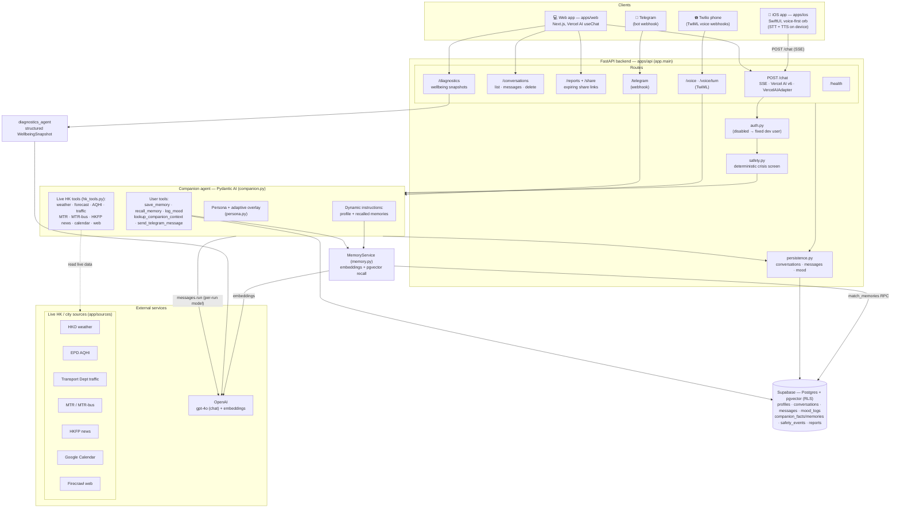
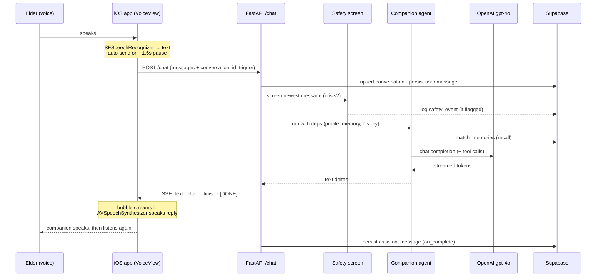

# Architecture — `tools/conversation-integration`

An AI **companion** for elderly Hong Kong residents. One Pydantic-AI agent powers
every channel (iOS voice, web chat, phone, Telegram), grounded in live HK data,
with long-term memory, crisis safety screening, and caregiver-facing wellbeing
reports. Auth is currently disabled — every request runs as a fixed dev user.

## System overview

## A voice turn, end to end

## Key facts

- **One agent, many channels.** `companion_agent` (Pydantic AI) is shared by web
  chat, phone (`/voice`), and Telegram. The model (`openai:gpt-4o`) is supplied
  **per run** so importing the module needs no key — `/health` and tests work
  offline.
- **`/chat` streams** the Vercel AI SDK v6 data-stream (SSE) via
  `VercelAIAdapter`; requires a `trigger:"submit-message"` discriminator. The web
  app consumes it with `useChat`; the iOS app parses the SSE directly.
- **Memory** is OpenAI embeddings + pgvector retrieval through the RLS-scoped
  `match_memories` Supabase RPC; injected into the agent's dynamic instructions.
- **Safety** is a deterministic regex screen on each incoming message — surfaces
  crisis resources and writes a `safety_events` row; it is a safety net, not a
  classifier.
- **Wellbeing reports** come from a separate structured-output `diagnostics_agent`
  producing a non-clinical `WellbeingSnapshot`, shared with relatives via expiring
  links (`/reports`, `/share`).
- **Auth is disabled** (`auth.py`): every request is the fixed `dev_user_id`;
  `user_client("")` falls back to the Supabase service-role client.
- **Live HK tools** are `@tool_plain` (no user context) reading public HK feeds in
  `app/sources/`; persona-driven user tools are `@tool` (carry `CompanionDeps`).
